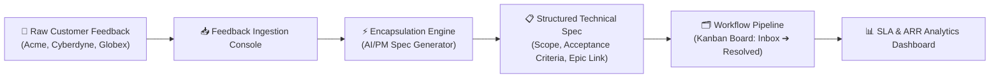

# EncapFlow — Enterprise Customer Feedback & Encapsulation System
## Executive Demo Guide & Walkthrough Script

> [!NOTE]
> **EncapFlow** is an enterprise-grade customer feedback encapsulation platform designed for Product Management, Customer Engineering, and Support teams. It bridges the gap between unstructured high-value enterprise customer feedback and structured, developer-ready technical specifications.

---

## 🏛️ System Architecture Overview

---

## 🎭 Demo Personas & Roles

EncapFlow includes pre-configured demo personas to demonstrate role-based access control (RBAC) and team workflows:

| Persona | Role | Key Capabilities | Best Demo Use Case |
| :--- | :--- | :--- | :--- |
| **Elena Rostova** | Principal Product Manager | Encapsulate feedback, assign Jira Epics, transition stages, view analytics | **Main Demo Driver** — Encapsulation & Spec creation |
| **Marcus Vance** | Senior Enterprise Support Lead | Triage feedback, log customer tickets, add support comments | Customer escalation & initial triage flow |
| **Dr. Evelyn Sterling**| VP of Customer Engineering (Admin) | Full admin access, fast-track workflow, override SLA, manage roles | Admin governance & high-ARR executive overview |
| **David Chen** | VP Technology (Acme Financial) | Customer Rep — Submit feedback, view account status | End-customer feedback submission flow |

---

## 🎬 Step-by-Step Demo Walkthrough Script

### Step 1: Enterprise SSO & Persona Authentication
1. Launch the application (running on `http://localhost:5173`).
2. Notice the **Monochromatic Enterprise Dark / Light Mode** theme options.
3. Select **Elena Rostova (Principal Product Manager)** from the preset persona tiles.
4. Click **Sign In to Workflow Console** (simulating SAML 2.0 Federated SSO authentication).

> [!TIP]
> You can switch active demo personas at any time using the quick persona dropdown in the top-right of the header bar!

---

### Step 2: Module 1 — Feedback Ingestion Console
*Navigation: Click **Feedback Ingestion** tab in the top header.*

- **Overview**: View all inbound enterprise customer requests categorized by priority (`P0_CRITICAL` to `P3_LOW`), customer tier (`ENTERPRISE_VIP` to `SMB`), and SLA status.
- **Key Metrics Bar**:
  - Total Active Feedback items.
  - Active SLA Breaches.
  - Monitored ARR Impact (e.g., **$4.85M ARR**).
- **Interactive Features**:
  - Filter by Priority (`P0 Critical`), Customer Tier (`ENTERPRISE_VIP`), or Stage.
  - Search by code (e.g. `FB-8901`) or keyword (`SSO`, `Rate Limiting`).
  - Observe real-time SLA status badges: **SLA Active** vs **SLA Breached**.

---

### Step 3: Module 2 — Encapsulation Engine (The Core Feature)
*Navigation: Click **Encapsulation Engine** tab or click **Encapsulate** on any raw item (e.g. `FB-8901`).*

1. Locate item **FB-8901** (*SAML 2.0 Identity Provider Timeout on Multi-Tenant SSO Federation* submitted by *Acme Financial - $1.2M ARR*).
2. Click **Encapsulate into Spec**.
3. **The Encapsulation Wizard Opens**:
   - **Step 1: Core Problem & Revenue Impact**: Review raw complaint vs parsed problem statement and ARR at risk.
   - **Step 2: Technical Scope & Architecture**: Review generated technical scope items (e.g., Redis-backed sliding window rate limiter, SAML token persistence).
   - **Step 3: Acceptance Criteria & Jira Link**: Define acceptance criteria and link to target Jira Epic (e.g., `EPIC-SEC-108`).
4. Click **Generate & Save Technical Specification**.
5. Observe the spec confidence score (**94% - 98% Fit Confidence**) and auto-transition to `encapsulated` stage!

> [!IMPORTANT]
> Encapsulation prevents product clutter by converting vague complaints into unambiguous engineering requirements with clear acceptance criteria before entering the developer backlog.

---

### Step 4: Module 3 — Enterprise Workflow Pipeline (Kanban Board)
*Navigation: Click **Workflow Pipeline** tab in the header.*

- **Kanban Columns**: `Inbox` ➔ `Triaged` ➔ `Encapsulated` ➔ `Backlog` ➔ `In Progress` ➔ `Resolved`.
- **Drag-and-Drop / Action Transitioning**:
  - Move **FB-8902** (*REST API Rate Limiting*) from `Encapsulated` to `In Progress`.
  - Notice the automated audit log entry generated immediately.
- **Card Highlights**:
  - Priority badges (`P0 CRITICAL`, `P1 HIGH`).
  - Customer ARR tag (`$2.4M ARR`).
  - SLA deadline timer countdown.

---

### Step 5: Item Audit Trail & Customer Detail Drawer
1. Click on any feedback card or row to open the **Feedback Details Drawer**.
2. **Review the Tabs**:
   - **Overview**: View original customer quote, customer SLA tier, tags, and assigned persona.
   - **Technical Specification**: Inspect the full encapsulated spec, technical scope list, and acceptance criteria.
   - **Audit Trail**: View immutable system audit logs recording every action, actor name, timestamp, and stage change.
   - **Team Discussion**: Add comments as the active persona.

---

### Step 6: Module 4 — SLA & Analytics Dashboard
*Navigation: Click **SLA & Analytics** tab in the header.*

- **Compliance Gauges**: Real-time SLA compliance percentage (e.g., **80.0% Compliant**).
- **ARR at Risk Breakdown**: Revenue distribution across Customer Tiers (`ENTERPRISE_VIP`, `ENTERPRISE`, `MID_MARKET`).
- **Category Health Matrix**: Feedback volume & breach rate across Security/Compliance, Performance, API Integration, and Analytics.

---

## 🛠️ Demo Submission Test (Live Interactive Flow)

To perform a complete live end-to-end demonstration during a presentation:

1. Click **+ New Feedback** in the header.
2. Select Account: **Acme Global Financial ($1.2M ARR)**.
3. Select Category: **SECURITY_COMPLIANCE**.
4. Set Priority: **P0_CRITICAL**.
5. Enter Title: `Custom Audit Log Export for SOC2 Compliance Audit`.
6. Enter Raw Feedback: `Our security auditor requires automated daily CSV delivery of all admin privilege grants to an encrypted S3 bucket.`.
7. Click **Submit Feedback Entry**.
8. Notice how the system automatically calculates a **4-Hour SLA Deadline** based on Acme's `ENTERPRISE_VIP` tier!
9. Immediately encapsulate the newly created item into a technical spec and transition it on the Kanban board!

---

## ⚙️ Key Technical Highlights for Evaluators

- **UI Framework**: React 19 + TypeScript + Vite.
- **Styling**: Monochromatic CSS token design system with dark/light mode switching (`data-theme="dark|light"`).
- **Layout Architecture**: Flexbox layout with strict `flex-shrink: 0` bounds and hidden overflow navigation to ensure zero UI collisions across viewports.
- **Type Safety**: Strictly typed domain model (`FeedbackItem`, `EncapsulatedSpec`, `UserPersona`, `AuditLog`).
